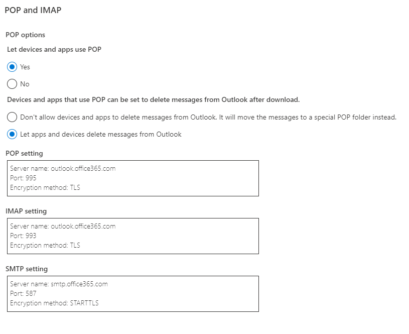

Hi.
The solution applied in the project in based in Outlook.
To use this in tests first you need to create an Outlook [account](https://signup.live.com/?lic=1) that will be used in 
your tests.

When the account it's already created [enable POP](https://outlook.live.com/mail/options/mail/accounts/popImap) in the 
account. 

Enjoy (*≧∀≦*)